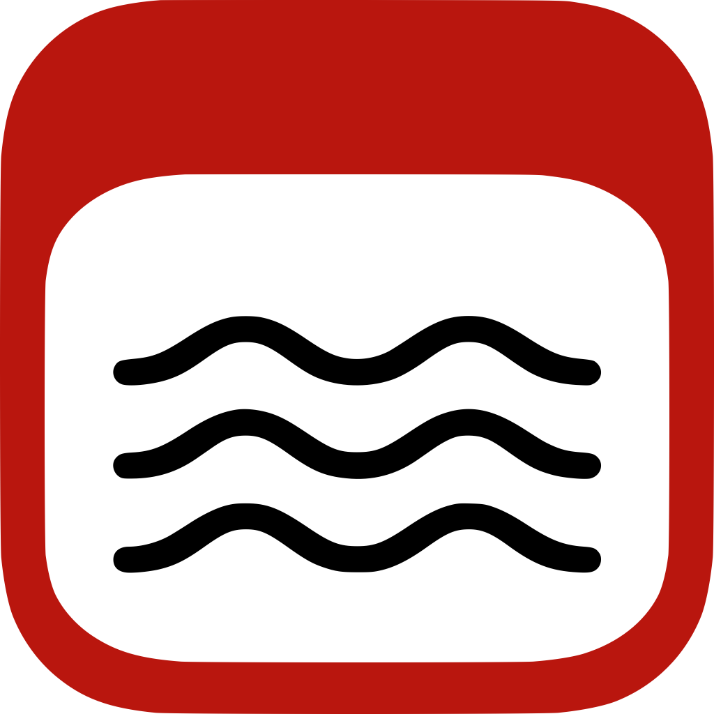
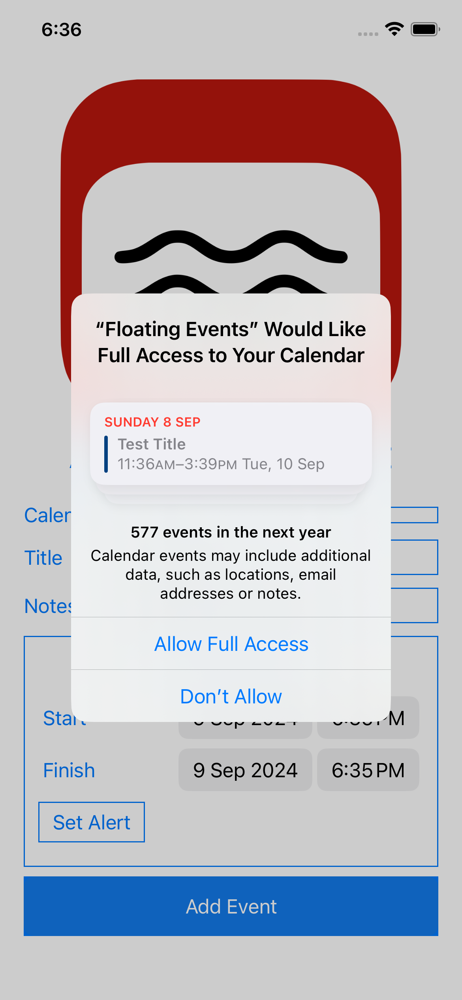
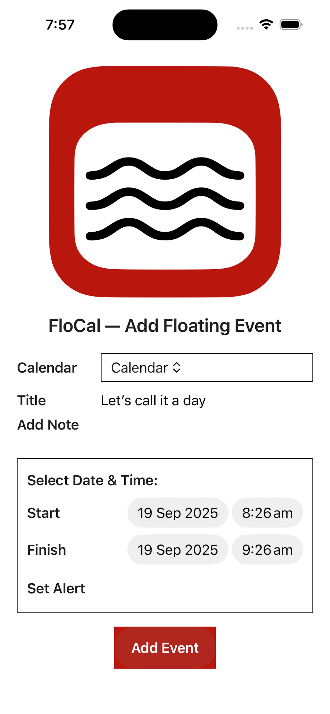
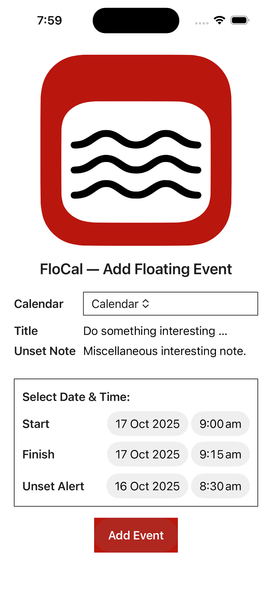

# FloCal

Support for FloCal iPhone App

##  Background

If you spend time travelling between time zones, then you’ll notice that it’s hard to get the date and time of new calendar events right; in particular it’s get to get the calendar alert right. That’s because you might set it in one time zone and the calendar adjusts the time for the other time zone.

The solution is simple: set the time zone to __Floating__ which means no time zone. Any date and time you set will always appear in the local time. The problem is that the iPhone Calendar App, for whatever reason, doesn’t give you the option. You would need to do this in your Mac. Or, you can use this little App.

The __FloCal__ app is there to do one job only: create a new floating event on your phone. The event will be added to the iPhone calendar of your choice.

##  How to Use

When you first use __FloCal__, you may be asked for permissions to use the calendar. The App needs to be able to read your available calendars, and, when the time comes, add a calendar event, which is the whole point.

You’ll then get the main screen. Well, the only screen:

-  Select a calendar
-  Select a Start date & time
-  Select a Finish date and time. This will default to the Start. You won’t be able to set it before the Start.
-  If you want to set a calendar alert, press the button and select the date and time. You won’t be able set it after the Start.

You now press the __Add Event__ button.

Any other changes can be made through the Calendar App, just like any other calendar event.

##  Bugs & Feature Requests

To create a bug report or feature request, click on the https://github.com/manngo/add-floating-event/issues link above.

TBH, I don’t think there’s much to be added to this app. It’s there to do one thing only, and that’s to create a floating event on your iPhone.

This App does what it does and doesn’t do what it doesn’t. E & OE. Share & Enjoy.
