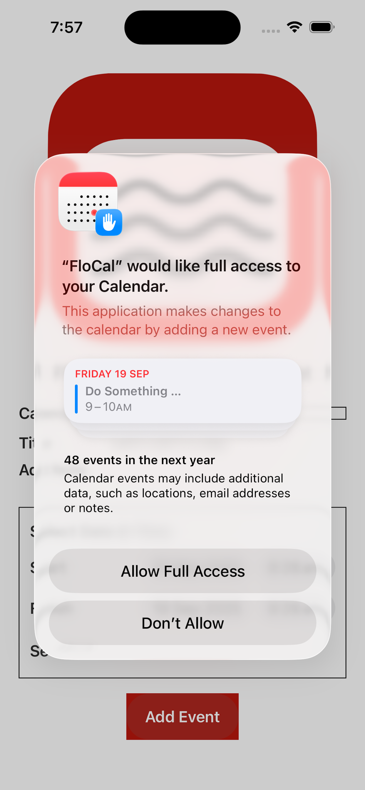

# FloCal

Support for FloCal iPhone App

##  Background

If you spend time travelling between time zones, then you’ll notice that it’s hard to get the date and time of new calendar events right; in particular it’s get to get the calendar alert right. That’s because you might set it in one time zone and the calendar adjusts the time for the other time zone.

The solution is simple: set the time zone to __Floating__ which means no time zone. Any date and time you set will always appear in the local time. The problem is that the iPhone Calendar App, for whatever reason, doesn’t give you the option. You would need to do this in your Mac. Or, you can use this little App.

The __FloCal__ app is there to do one job only: create a new floating event on your phone. The event will be added to the iPhone calendar of your choice.

##  How to Use

When you first use __FloCal__, you may be asked for permissions to use the calendar. The App needs to be able to read your available calendars, and, when the time comes, add a calendar event, which is the whole point.

You’ll then get the main screen. Well, the only screen:

-  Select a calendar
-  Select a Start date & time
-  Select a Finish date and time. This will default to the Start. You won’t be able to set it before the Start.
-  If you want to set a calendar alert, press the button and select the date and time. You won’t be able set it after the Start.

You now press the __Add Event__ button.

Any other changes can be made through the Calendar App, just like any other calendar event.

##	Privacy Policy

This privacy policy applies to the FloCal app (hereby referred to as "Application") for mobile devices that was created by Mark Simon (hereby referred to as "Service Provider") as a Free service. This service is intended for use "AS IS".

###	What information does the Application obtain and how is it used?

None. Nothing. We have no way of knowing what you do with the Application, and we really don’t care. We don’t know where you are, who you are, or what your plans are. There’s no registration, and we don’t collect any information about you.

###	Do third parties see and/or have access to information obtained by the Application?

What we don’t know about you certainly can’t be share with anybody else. We don’t collect information, and so we don’t pass anything on to third parties.

###	What are my opt-out rights?

No information about you is collected. However, if you wish, you can easily uninstall the appliction.

###	Children

The application requires access to your calendar, and is subject to the same age restrictions as your calendar.

###	Security

Since the Application does not collect any information, there’s no risk of your data being accessed by unauthorised individuals.

###	Changes

This Privacy Policy may be updated from time to time if necessary. We’ll notify you of any changes to their Privacy Policy by updating this page with the new Privacy Policy.

This privacy policy is effective as of 2025-09-19.

###	Your Consent

By using the Application, you are consenting to the processing of your information as set forth in this Privacy Policy now and as amended by the Service Provider.

###	Contact Us

If you have any questions regarding privacy while using the Application, or have questions about the practices, please contact the Service Provider the https://github.com/manngo/flocal-support/issues link above.

##  Bugs & Feature Requests

To create a bug report or feature request, click on the https://github.com/manngo/flocal-support/issues link above.

TBH, I don’t think there’s much to be added to this app. It’s there to do one thing only, and that’s to create a floating event on your iPhone.

This App does what it does and doesn’t do what it doesn’t. E & OE. Share & Enjoy.
